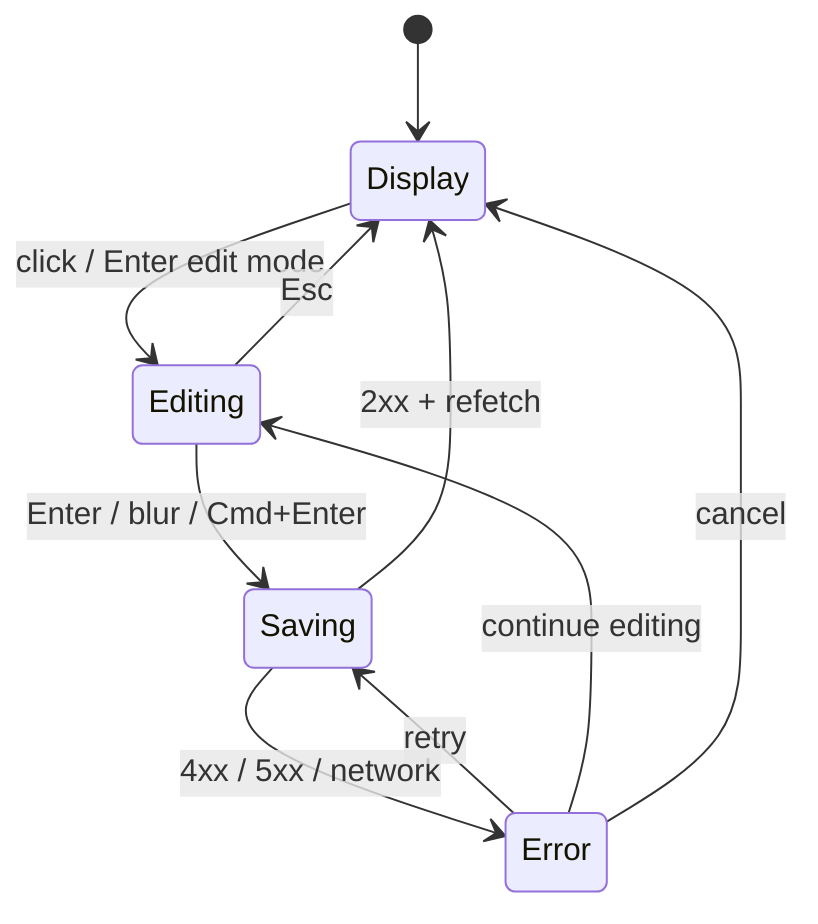
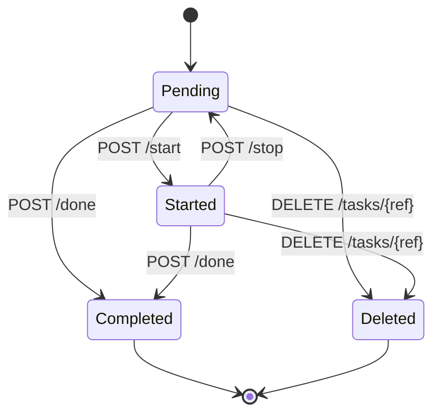
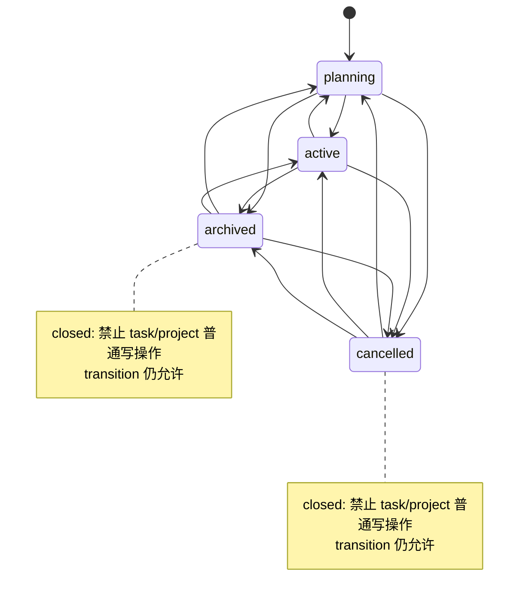

# Web Console 项目与任务编辑体验设计

**日期：** 2026-06-27
**状态：** 已完成
**范围：** 普通 Workspace Console 的 project / task 编辑体验
**承接：**

- `2026-06-12-xuanchu-v0.4.2-project-readonly-view-design.md`
- `2026-06-17-web-console-project-task-browsing-design.md`
- `2026-06-15-xuanchu-project-lifecycle-design.md`
- `2026-06-22-xuanchu-task-title-description-design.md`

> 给 agentic workers 的要求：编码前必须先使用 `superpowers:writing-plans` 将本文档拆成实施计划。不要直接从本规格开始写代码。

## 1. 背景

当前 Web Console 已经把项目浏览主路径打通：

- `/projects` 列出 workspace 内项目。
- `/workspaces/:workspaceSlug/projects/:projectSlug` 展示项目摘要、过滤工具栏、任务列表、timeline。
- `/workspaces/:workspaceSlug/projects/:projectSlug/tasks/:taskRef` 展示任务详情、注解、链接、依赖和 UDA。

但这套 UI 仍是 `project-readonly` 形态。后端 API 已经具备主要写能力：

- project：创建、修改、归档、状态转移。
- task：创建、修改、完成、删除、开始、停止、注解、删除注解、添加链接、删除链接。

因此本阶段不是补一套新的业务后端，而是把现有 `/api/v1/*` 写能力以可靠、低摩擦的方式暴露到 Workspace Console。设计方向参考 Linear / Jira / Notion 等主流项目管理工具的交互经验：列表内高频字段快速编辑，详情页承担结构化修改和确认，危险操作显式确认。

## 2. 目标

1. 项目页从“只读浏览”升级为“项目上下文内可编辑工作台”。
2. 高频、低风险字段优先使用 inline edit，减少跳转和弹窗。
3. 创建、删除、项目 slug、依赖、链接等结构复杂或风险较高的操作使用 dialog / popover / confirm。
4. 所有写操作继续走现有 Workspace API，不绕过 membership、token scope、workspace allowlist、project allowlist、project closed 状态或 acting session 审计。
5. 写操作成功后保持用户的当前位置、过滤条件和项目上下文，不把用户带回全局页。
6. UI 文案、空态、错误态以中文为主，保留 i18n key 结构。

## 3. 非目标

- 不做拖拽看板。
- 不做全局跨项目任务 inbox。
- 不做批量编辑。
- 不做评论实时协同或富文本编辑器。
- 不做任务 reopen。当前后端没有 reopen API，已完成任务的恢复另行设计。
- 不新增 project owner 字段。
- 不把 Web Console 做成 Jira-like 全功能管理平台；本阶段仍围绕 Xuanchu 的 workspace / project / task 运行时能力。
- 不改变后端权限模型，不新增前端专用授权绕过接口。
- 不新增 SSO、飞书 OAuth、cookie session。

## 4. 核心决策

| 议题 | 决策 |
|---|---|
| 写能力入口 | Project-first：所有 task 写操作优先在项目上下文内发生 |
| 高频字段编辑 | inline edit：title、description、priority、due、assignees、tags、project name、project description |
| 风险操作 | dialog / confirm：删除任务、删除链接、删除注解、修改 project slug、项目进入 closed 状态 |
| 任务状态 | 不做通用 status 下拉；使用后端现有 `start` / `stop` / `done` / `delete` 动作 |
| 项目状态 | 使用状态下拉 + closed 状态二次确认；任意状态可转任意状态 |
| 成功反馈 | 就地更新 + 小型 saving/saved/error 状态，不弹全局 toast 作为唯一反馈 |
| 失败恢复 | inline 编辑失败保持编辑态，显示字段级错误，可重试或 Esc 放弃 |
| 数据同步 | mutation 成功后 invalidate/refetch 相关 query，响应体不作为唯一真实源 |
| 权限显示 | 前端基于 `/api/v1/me` 粗判断是否显示写控件，服务端 403 仍是最终事实 |

### 4.1 哪些适合 inline，哪些不适合

Inline edit 适合满足三个条件的字段：

1. 字段本身可局部保存。
2. 保存失败不会破坏上下文。
3. 用户能直接理解修改结果。

因此适合 inline 的字段：

- Project：name、description。
- Task：title、description、priority、due、assignees、tags、wait、scheduled、until、recur、UDA 值。

不适合 inline 的操作：

- Project slug：会改变 URL 与路由身份，必须放在“项目设置”dialog。
- Project status 转 closed：会使项目禁写，必须确认。
- Task delete：破坏性操作，必须确认。
- Task links：包含 type/url/title 三字段，使用 dialog 更清晰。
- Task dependencies / parent：需要搜索和校验任务引用，使用 picker dialog。
- 新建 project：至少需要 slug/name，使用 dialog。

## 5. 用户与权限

### 5.1 用户类型

| 用户 | 能力预期 |
|---|---|
| owner / admin + 对应 scope | 可编辑项目核心信息、项目状态、任务和项目配置 |
| member + task:write | 可创建和编辑任务，但不能管理 project 核心结构 |
| viewer 或缺写 scope | 只能浏览，写控件隐藏或 disabled |
| admin acting session | 按当前 actor 的 workspace membership 重新判权，不信任 acting session 创建时 role 快照 |

### 5.2 前端粗判断

前端使用 `GET /api/v1/me`：

- `effective_role`
- `token.scopes`
- `effective_workspace`

粗略判断：

```text
canTaskWrite =
  scope 包含 "*" 或 "task:write"
  且 role 是 owner/admin/member

canProjectManage =
  scope 包含 "*" 或 "project:write"
  且 role 是 owner/admin
```

前端判断只用于减少无效操作入口；真实权限以 API 返回为准。任何 403 / `token_scope_denied` / `permission_denied` / `project_scope_denied` 都必须展示明确错误，并把对应 inline editor 恢复到可处理状态。

## 6. 信息架构

```text
/projects
  项目列表
  - 新建项目
  - 行点击进入项目
  - 行内状态查看，管理操作收敛到行末菜单

/workspaces/:workspaceSlug/projects/:projectSlug
  项目工作台
  - 项目 header：name/description inline，status 下拉，设置菜单
  - 任务过滤工具栏
  - 快速新建任务 composer
  - 任务表格：常用字段 inline edit
  - 最近动态

/workspaces/:workspaceSlug/projects/:projectSlug/tasks/:taskRef
  任务详情
  - title/description inline
  - 顶部动作：开始/停止/完成/删除
  - 注解 composer + 注解删除
  - 链接列表 + 添加/删除
  - 右侧属性栏 inline edit
  - 依赖/父任务 picker
```

## 7. 页面交互设计

### 7.1 项目列表页

项目列表页保持“扫描与进入项目”为主，不承载大量编辑。允许的写入口：

- 顶部“新建项目”按钮：打开 `ProjectCreateDialog`。
- 行末 `...` 菜单：进入项目、编辑项目设置、状态转移。
- 状态 badge：只展示，不直接 inline 修改，避免误触。

ASCII 原型：

```text
+--------------------------------------------------------------------------------+
| 项目                                                        [ + 新建项目 ]       |
+--------------------------------------------------------------------------------+
| 过滤: [open ▾]  [搜索项目...]                                                    |
+--------------------------------------------------------------------------------+
| 项目                         状态       进度        任务数          操作          |
|--------------------------------------------------------------------------------|
| 广告投放自动化                 active     42%         18 / 43        [进入] [...] |
| 飞书消息接入                   planning   0%          0 / 0          [进入] [...] |
| 旧数据迁移                     archived   100%        32 / 32              [...] |
+--------------------------------------------------------------------------------+
```

`ProjectCreateDialog`：

```text
+------------------------------------------+
| 新建项目                                  |
|------------------------------------------|
| Slug                                      |
| [ adsops    ]  3-10 位小写字母数字         |
|                                          |
| 名称                                      |
| [ 广告投放自动化                         ] |
|                                          |
| 描述                                      |
| [ 面向投放团队的自动巡检与任务运行时...    ] |
|                                          |
|                            [取消] [创建] |
+------------------------------------------+
```

创建成功后跳转到新项目详情页。失败时保留 dialog 和用户输入。

### 7.2 项目工作台 header

项目 header 是项目级编辑的主入口：

- 项目 name：点击文字进入 inline input；Enter 保存，Esc 取消，blur 保存。
- 项目 description：点击后变为 textarea；Cmd/Ctrl+Enter 保存，Esc 取消。
- 状态：下拉选择 `planning / active / archived / cancelled`。
- 复制链接：只复制当前 URL，不复制 token。
- 设置：打开项目设置 dialog，可修改 slug。

ASCII 原型：

```text
workspace / adsops

[广告投放自动化________________]       [planning ▾] [复制链接] [设置]
[面向投放团队的自动巡检与任务运行时...                       ]

任务 43 · 待处理 18 · 已完成 25 · 高优先级 5
```

项目状态下拉：

```text
[planning ▾]
  planning
  active
  archived     -> 需要确认：进入 archived 后项目内任务禁写
  cancelled    -> 需要确认：进入 cancelled 后项目内任务禁写
```

状态转移规则：

- 任意状态可转任意状态，遵循已有 project lifecycle 设计。
- 转到 `archived` / `cancelled` 前确认。
- 从 closed 状态转回 `planning` / `active` 不需要危险确认，但需要明确显示“恢复后可写”。
- 转移成功后刷新 project、projects list、timeline、tasks query。

### 7.3 任务过滤与快速创建

过滤工具栏继续保留 URL 同步。其下增加快速创建 composer：

```text
+--------------------------------------------------------------------------------+
| [状态: pending ▾] [优先级: H ▾] [负责人...] [搜索...]                清除全部    |
+--------------------------------------------------------------------------------+
| + 新任务: [ 输入任务标题...                                      ] [创建] [更多] |
+--------------------------------------------------------------------------------+
```

快速创建默认写入当前项目：

```json
{
  "title": "...",
  "project": "<projectSlug>"
}
```

“更多”展开同一行的可选字段：

```text
| + 新任务: [任务标题...] [priority ▾] [due date] [assignees ▾] [+tag] [创建] |
```

交互规则：

- Enter 创建；Shift+Enter 换行不适用，因为 title 是单行。
- 创建成功后 composer 清空，任务插入当前列表并 refetch。
- 如果当前过滤条件会隐藏新任务，显示小提示：“任务已创建，但被当前过滤条件隐藏。”，并提供“清除过滤”。
- 当前 project 是 `archived` / `cancelled` 时 composer 隐藏，改为 closed banner。

### 7.4 任务表格 inline 编辑

任务表格是高频编辑区，类似 Linear 的轻量列表体验。

可 inline 编辑列：

| 列 | 交互 | API |
|---|---|---|
| title | 点击文字进入 input | `PATCH /api/v1/tasks/{ref}` `{title}` |
| priority | 点击 badge 打开小菜单 | PATCH `{priority}` 或 `{clear_priority:true}` |
| assignees | 点击头像/姓名打开 user picker | PATCH `{assignees:[...], clear_assignees:true}` |
| due | 点击日期打开 date input/popover | PATCH `{due}` 或 `{clear_due:true}` |
| tags | 点击标签区域打开 tag editor | PATCH `{tags:[...], remove_tags:[...]}` |

状态列不做直接编辑，使用动作按钮：

| 当前状态 | 动作 |
|---|---|
| pending 且未 start | 开始、完成、删除 |
| pending 且已 start | 停止、完成、删除 |
| completed | 无快速写操作；详情页展示只读状态 |
| deleted | 默认列表不显示 |

ASCII 原型：

```text
+------------------------------------------------------------------------------------------------+
| ID        标题                                  状态       优先级   负责人       截止      操作 |
|------------------------------------------------------------------------------------------------|
| ads-12    [素材自动标记规则________]           pending    [H ▾]    [张三 ▾]    [6-30]   ▶ ✓ ... |
| ads-13    修复飞书回调签名校验                  pending    [M ▾]    [- ▾]      [-]      ▶ ✓ ... |
| ads-14    输出周报模板                          completed  L        李四        6-20        ... |
+------------------------------------------------------------------------------------------------+
```

行级 `...` 菜单：

- 打开详情
- 复制任务链接
- 添加注解
- 添加关联链接
- 删除任务（confirm）

### 7.5 任务详情页

任务详情页承担完整编辑。布局保持当前主区 + 右侧属性栏，但把静态字段升级为 inline editor。

ASCII 原型：

```text
adsops / ads-12                                      [开始] [完成] [...] [返回项目]

[素材自动标记规则_____________________________________________]

详细描述
+--------------------------------------------------------------------------+
| 为素材上传后的命名、标签、审批状态补一个自动标记规则。                     |
|                                                                          |
+--------------------------------------------------------------------------+

注解
+--------------------------------------------------------------------------+
| [写一条注解...                                               ] [添加]     |
|--------------------------------------------------------------------------|
| 张三  06-27 10:20  需要同时覆盖 video/image 两类素材             [...]    |
| 李四  06-26 18:03  已确认飞书卡片入口                              [...]    |
+--------------------------------------------------------------------------+

关联链接
+--------------------------------------------------------------------------+
| spec       Web Console 编辑体验设计        https://...                   |
| issue      #42 task table inline edit      https://...             [删除] |
| [ + 添加链接 ]                                                           |
+--------------------------------------------------------------------------+

右侧属性栏
+---------------------------+
| 属性                      |
| 状态       pending        |
| 开始       [开始任务]      |
| 优先级     [H ▾]          |
| 负责人     [张三, 李四 ▾]  |
| 截止       [2026-06-30]   |
| 标签       [+web +console]|
| 依赖       [选择任务...]   |
| 父任务     [选择任务...]   |
| wait       [-]            |
| scheduled  [-]            |
| until      [-]            |
| recur      [-]            |
|---------------------------|
| 自定义字段                |
| estimate   [4h]           |
| channel    [feishu]       |
| [ + 添加自定义字段 ]       |
+---------------------------+
```

标题保存：

- Enter 保存。
- Esc 取消。
- 空标题不提交，字段级提示“标题不能为空”。

描述保存：

- Cmd/Ctrl+Enter 保存。
- Esc 取消。
- 空值提交为 `{clear_description:true}`。

注解：

- 添加注解使用 inline composer，提交 `POST /api/v1/tasks/{taskRef}/annotations`。
- 删除注解在行末菜单，二次确认后 `DELETE /api/v1/tasks/{taskRef}/annotations/{annotationID}`。
- 成功后 refetch task detail 和 annotations list。

链接：

- 添加链接使用 dialog：type、url、title。
- URL 前端做基础格式检查，服务端仍是最终校验。
- 删除链接需要确认。

依赖 / 父任务：

- 使用 task picker dialog，数据源先复用当前项目任务列表；后续如需跨项目依赖再扩展。
- depends 修改走 `PATCH /api/v1/tasks/{ref}` `{depends:[...]}` 或 `{clear_depends:true}`。
- 当前 API 没有 parent 修改字段，父任务编辑暂不落地；详情页只读展示 parent，picker 留作后续扩展，避免前端假装支持。

## 8. 状态图

### 8.1 Inline 编辑状态



字段级错误必须贴近字段展示，不用全局错误替代。保存中字段应有明确 loading 状态，并禁用重复提交。

### 8.2 任务动作状态



说明：

- `Started` 不是独立 `status`，而是 `status=pending` 且 `start != null`。
- 当前阶段不设计 completed -> pending 的 reopen。

### 8.3 项目状态



## 9. 数据流

### 9.1 查询与 mutation

```mermaid
flowchart LR
    UI[Web Console React UI]
    Query[React Query Cache]
    API[workspace-api.ts]
    HTTP[/api/v1/*]
    App[internal/app Service]
    Store[(SQLite / PostgreSQL)]

    UI --> Query
    Query --> API
    API --> HTTP
    HTTP --> App
    App --> Store
    Store --> App
    App --> HTTP
    HTTP --> API
    API --> Query
    Query --> UI
```

Mutation 成功后不要只依赖 mutation response。原因：

- `PATCH /tasks/{ref}` 返回 `task.ToJSON`，不一定包含详情页需要的 `depends_info` / `parent_info` / `blocked_by_info`。
- project slug 修改后需要导航到新路径。
- timeline、统计、列表过滤结果都可能变化。

因此 mutation hook 统一做：

1. 调用 API。
2. 成功后 invalidate 相关 query。
3. 需要路由变化时再 navigate。
4. 失败时把错误返回给字段或 dialog。

### 9.2 Query key 建议

```text
["me"]
["projects", workspaceSlug, statusFilter]
["project", workspaceSlug, projectSlug]
["project", workspaceSlug, projectSlug, "tasks", filterQuery]
["project", workspaceSlug, projectSlug, "timeline"]
["task", workspaceSlug, projectSlug, taskRef]
["users", workspaceSlug]
```

当前已有 query key 可逐步迁移，但新代码不要继续使用含 `readonly` 的命名作为公共接口名。可保留旧目录名作为过渡，后续实现时建议：

```text
web/src/features/workspace/project-readonly/
  -> web/src/features/workspace/project-workbench/
```

重命名不是第一步必须项，但最终不应让“可编辑页面”继续叫 readonly。

## 10. API 映射

### 10.1 Project

| UI 操作 | API | 请求 |
|---|---|---|
| 新建项目 | `POST /api/v1/projects` | `{slug,name,description}` |
| 修改名称 | `PATCH /api/v1/projects/{projectRef}` | `{name}` |
| 修改描述 | `PATCH /api/v1/projects/{projectRef}` | `{description}` |
| 修改 slug | `PATCH /api/v1/projects/{projectRef}` | `{slug}` |
| 状态转移 | `POST /api/v1/projects/{projectRef}/transition` | `{status}` |
| 归档快捷操作 | 优先使用 transition | `{status:"archived"}` |

### 10.2 Task

| UI 操作 | API | 请求 |
|---|---|---|
| 快速新建任务 | `POST /api/v1/tasks?workspace=&project=` | `{title,project,priority,due,assignees,tags}` |
| 修改标题 | `PATCH /api/v1/tasks/{taskRef}` | `{title}` |
| 修改描述 | `PATCH /api/v1/tasks/{taskRef}` | `{description}` / `{clear_description:true}` |
| 修改优先级 | `PATCH /api/v1/tasks/{taskRef}` | `{priority}` / `{clear_priority:true}` |
| 修改 due | `PATCH /api/v1/tasks/{taskRef}` | `{due}` / `{clear_due:true}` |
| 修改 assignees | `PATCH /api/v1/tasks/{taskRef}` | `{assignees,remove_assignees,clear_assignees}` |
| 修改 tags | `PATCH /api/v1/tasks/{taskRef}` | `{tags,remove_tags}` |
| 修改 wait/scheduled/until | `PATCH /api/v1/tasks/{taskRef}` | `{wait}` / `{clear_wait:true}` 等 |
| 修改 recur | `PATCH /api/v1/tasks/{taskRef}` | `{recur}` / `{clear_recur:true}` |
| 修改 UDA | `PATCH /api/v1/tasks/{taskRef}` | `{udas}` / `{clear_udas}` |
| 修改 depends | `PATCH /api/v1/tasks/{taskRef}` | `{depends}` / `{clear_depends:true}` |
| 开始 | `POST /api/v1/tasks/{taskRef}/start` | 空 body |
| 停止 | `POST /api/v1/tasks/{taskRef}/stop` | 空 body |
| 完成 | `POST /api/v1/tasks/{taskRef}/done` | 空 body |
| 删除 | `DELETE /api/v1/tasks/{taskRef}` | 空 body |
| 添加注解 | `POST /api/v1/tasks/{taskRef}/annotations` | `{description}` |
| 删除注解 | `DELETE /api/v1/tasks/{taskRef}/annotations/{annotationID}` | 空 body |
| 添加链接 | `POST /api/v1/tasks/{taskRef}/links` | `{type,url,title}` |
| 删除链接 | `DELETE /api/v1/tasks/{taskRef}/links/{linkID}` | 空 body |

### 10.3 User picker

负责人选择优先复用：

```text
GET /api/v1/users
GET /api/v1/workspaces/{workspace}/members
```

首版建议使用 workspace members 作为候选，展示 `name / email / role`。提交到 task API 时使用 user id 或已有后端可解析的 user ref。

## 11. 错误与空态

### 11.1 权限不足

```text
你可以查看这个项目，但当前身份不能编辑。
需要：task:write 或 project:write
当前：viewer / scopes: task:read, project:read
```

前端表现：

- 读页面正常展示。
- 写控件隐藏或 disabled。
- 如果用户通过旧 UI 状态触发写请求并收到 403，显示字段级或 dialog 内错误。

### 11.2 项目 closed

`archived` / `cancelled` 项目顶部显示 banner：

```text
该项目已 archived，任务和项目内容不可编辑。管理员可通过状态菜单恢复为 planning 或 active。
```

表现：

- 任务 composer 隐藏。
- task inline edit 禁用。
- task destructive 操作禁用。
- project transition 仍保留给 canProjectManage 用户。

### 11.3 保存失败

inline 字段失败状态：

```text
[素材自动标记规则________]  保存失败：token scope 不足  [重试] [取消]
```

要求：

- 不丢失用户输入。
- 不静默回滚。
- Esc 或取消恢复保存前值。

### 11.4 过滤隐藏新任务

创建成功但当前过滤条件不匹配：

```text
任务已创建，但被当前过滤条件隐藏。 [查看任务] [清除过滤]
```

## 12. 组件拆分

建议新增或重命名为按子目录分类的结构，避免所有组件平铺在一个 feature 目录下：

```text
web/src/features/workspace/project-workbench/
  api/
    project-api.ts
    task-api.ts
    users-api.ts

  hooks/
    use-project-mutations.ts
    use-task-mutations.ts
    use-project-data.ts
    use-task-detail-data.ts

  permissions/
    permissions.ts
    permissions.test.ts

  shared/
    inline-text-editor.tsx
    inline-select-editor.tsx
    inline-date-editor.tsx
    assignee-picker.tsx
    tag-editor.tsx
    destructive-confirm-dialog.tsx

  projects/
    projects-list-page.tsx
    project-create-dialog.tsx
    project-row-actions.tsx

  project/
    project-workbench-page.tsx
    project-header-editor.tsx
    project-status-menu.tsx
    project-settings-dialog.tsx
    project-closed-banner.tsx

  tasks/
    task-quick-create.tsx
    task-table.tsx
    task-row-actions.tsx

  task-detail/
    task-detail-page.tsx
    task-action-bar.tsx
    task-annotations-editor.tsx
    task-links-editor.tsx
    task-property-panel.tsx
    task-dependency-picker.tsx
```

目录职责：

| 子目录 | 职责 |
|---|---|
| `api/` | 只放 Workspace API path builder 与请求函数，不含 React 状态 |
| `hooks/` | React Query 查询、mutation 与 invalidate 规则 |
| `permissions/` | `/api/v1/me` 到前端写控件可见性的粗判断 |
| `shared/` | project/task 共用的小型编辑控件，仍限定在本 feature 内 |
| `projects/` | `/projects` 项目列表、创建与行操作 |
| `project/` | 单个项目工作台 header、状态、设置、closed banner |
| `tasks/` | 项目页内任务 composer、任务表格、行操作 |
| `task-detail/` | 任务详情页的完整编辑体验 |

通用 inline editor 可以先放在 `project-workbench/shared/`，不急于提升到 `components/ui`。只有当 token、members、settings 等页面也复用时再抽公共组件。

## 13. 前端交互细节

### 13.1 键盘

| 场景 | 快捷键 |
|---|---|
| 单行 inline editor | Enter 保存，Esc 取消 |
| 多行 description | Cmd/Ctrl+Enter 保存，Esc 取消 |
| 快速新建任务 | Enter 创建 |
| 菜单 / dialog | 遵循 Radix 默认键盘行为 |

### 13.2 移动端

移动端不强求表格内复杂 inline 编辑：

- 任务列表移动端卡片只提供“打开详情”和行末菜单。
- 复杂编辑在任务详情页完成。
- 快速创建保留为单行 title composer，更多字段放入 dialog。

### 13.3 视觉原则

- 保持当前 console 的克制、密集、工具型风格。
- 不做营销式 hero 或大卡片堆叠。
- 按钮优先使用 lucide icon + tooltip，例如保存、取消、复制、更多、开始、完成、删除。
- 卡片半径沿用 shadcn 当前变量，不做一套新的视觉语言。
- 状态颜色用于传达含义：closed 状态和危险操作使用 destructive；普通 pending/active/planning 不使用强警示色。

## 14. 测试计划

### 14.1 前端单元测试

- `permissions.ts`：role/scope 到 canTaskWrite/canProjectManage 的粗判断。
- inline editor：保存、取消、失败保留输入、空标题校验。
- project header：name/description inline 保存；closed status 确认。
- task quick create：创建成功清空、过滤隐藏提示。
- task table：priority/due/assignee/tag mutation payload 正确。
- task detail：description 清空、注解添加/删除、链接添加/删除。

### 14.2 前端集成测试

- `/projects` 新建项目后跳转项目页。
- 项目页创建任务后列表刷新。
- 修改任务 title 后详情页和列表页都显示新值。
- viewer 或缺 scope 时不显示写入口。
- API 403 时显示字段级错误。
- closed project 禁用 task 写控件。

### 14.3 后端测试

本 spec 原则上复用已有后端 API，不要求新增后端接口。若实施中发现字段缺口，应补对应 HTTP 测试，尤其是：

- task mutation response 与 refetch 行为。
- project transition closed 后 task write 仍被拒绝。
- workspace/project scope 对写请求仍生效。

### 14.4 验证命令

前端相关：

```bash
pnpm --dir web typecheck
pnpm --dir web test
pnpm --dir web build
```

后端相关：

```bash
go test ./...
CGO_ENABLED=0 go test ./...
CGO_ENABLED=0 go build ./cmd/xuanchu
go vet ./...
git diff --check
```

如果只改 spec，至少运行：

```bash
git diff --check
```

## 15. 验收标准

1. `/projects` 可以创建项目，并能进入新项目页。
2. 项目详情页可以 inline 修改项目 name / description。
3. owner/admin 可以转移 project 状态；转入 `archived` / `cancelled` 有确认。
4. closed project 禁止 task 创建和编辑，但允许 project transition 恢复。
5. 项目详情页可快速创建任务。
6. 任务表格可 inline 修改 title、priority、due、assignees、tags。
7. 任务详情页可 inline 修改 title、description 和右侧属性。
8. 任务详情页可添加/删除注解，添加/删除链接。
9. 任务详情页支持 start/stop/done/delete；delete 有确认。
10. viewer 或缺写 scope 的身份仍可浏览，但不能看到或触发写控件。
11. 所有写操作失败时保留用户输入，并显示可理解错误。
12. 页面刷新、URL 过滤、任务详情深链在编辑后仍保持稳定。

## 16. 待确认问题

这些问题不阻塞首版 spec；本次实现的实际取舍如下：

1. UDA 首版只支持编辑已有字段，不支持新增/删除 UDA key。
2. 负责人属性栏首版提交逗号分隔的用户引用值，优先按 user id 使用；后续可替换为成员 picker。
3. task depends 首版在详情属性栏用逗号分隔任务引用提交，不做跨项目搜索 UI；后续可替换为当前项目 task picker。
4. task reopen API 当前不做，completed 任务不展示 start/stop/done。
5. 新可编辑页面已放入 `project-workbench/` 子目录；`project-readonly/` 中的 filter、stats、activity、UDA helper 仍作为过渡复用，未在本次把纯重命名和功能改动混在一起。
