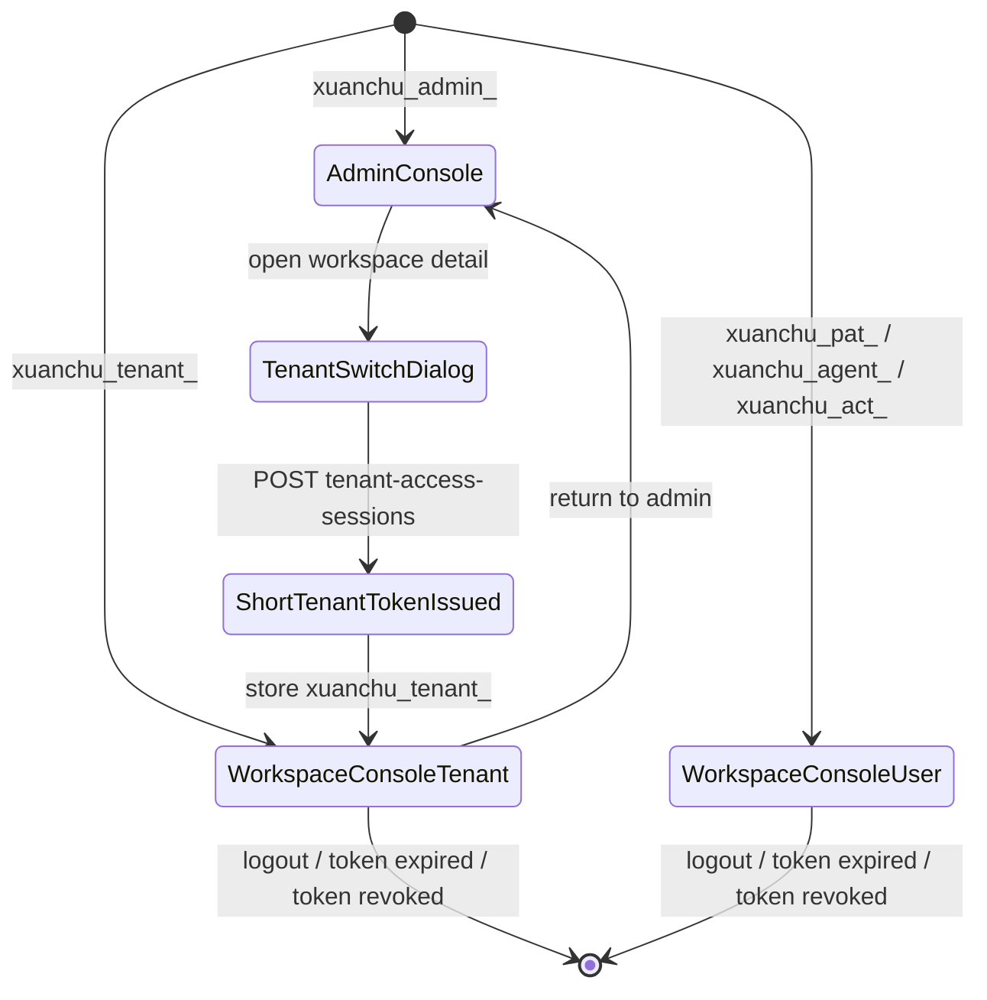
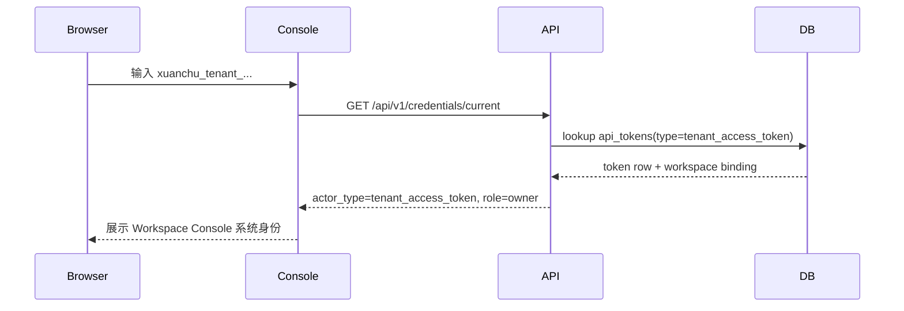
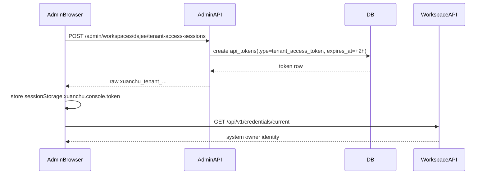

# Xuanchu Tenant Console System Owner 设计

**日期：** 2026-07-02
**状态：** 草案
**背景需求：** 现有 `tenant_access_token` 已支持 HTTP API / HTTP MCP，但不能登录 Web Console，也不能管理 user / member / token / workspace。新的产品目标是：`tenant_access_token` 可以作为 workspace 级“系统超管”进入 Web Console；server admin 在超管平台可以直接切换到某个 workspace 的 tenant 身份，像 owner 一样完成该 workspace 内的管理和业务操作。

## 1. 当前代码现状

当前实现已经具备这些基础：

- `api_tokens` 表支持 `type=tenant_access_token`，`user_id=NULL`，单 workspace 绑定。
- raw token 前缀为 `xuanchu_tenant_`。
- HTTP API / HTTP MCP 能识别 tenant token，并构造 `actor_type=tenant_access_token`。
- 审计、access log、MCP log 已能记录 token id / name / prefix。
- Web Console `/tokens` 和 `/admin/tokens` 已能管理 tenant token。
- server admin 已有 `/admin/workspaces` 和 `/admin/workspaces/:workspace` 控制面。
- server admin 已能创建 short-lived acting session，进入 workspace console 时使用 `xuanchu_act_...`，但 acting session 绑定的是某个真实 user。

当前限制也很明确：

- `docs/manual/web-console.md` 写明 tenant token 不作为浏览器登录凭证。
- `/api/v1/me` 对 tenant token 返回 `tenant_actor_not_user`。
- Web Console 普通入口依赖 `/api/v1/me` 来获得 actor、workspace、role。
- tenant scope 白名单不允许 `user:*`、`member:*`、`token:*`、`workspace:write`、`impersonate`。
- 多个 HTTP / MCP handler 显式 `rejectTenantActor`，阻止 tenant token 进入 user/member/token/workspace 管理路径。
- 创建带用户语义 `created_by` / `actor` 的资源时，tenant token 仍被拒绝或跳过事件投递。

这说明本次不是“前端允许输入 tenant token”这么小的改动，而是要把 tenant token 从“机器 API key”提升为“workspace 系统 owner credential”。

## 2. 产品语义

新的语义：

```text
tenant_access_token = workspace system owner credential
```

它不是自然人用户，也不写入 `users` 或 `memberships`；但在绑定 workspace 内可以拥有 owner 等价的管理能力。

认证后得到的 actor：

```text
actor_type = tenant_access_token
actor_user_id = null
actor_token_id = <token_id>
actor_token_name = <token_name>
actor_token_prefix = <token_prefix>
workspace_id = <bound_workspace_id>
role = owner-equivalent
```

对用户可见时称为：

```text
系统身份 / Tenant System Owner
```

示例展示：

```text
系统身份 · runtime-prod · owner · dajee
```

## 3. 目标

1. Web Console 登录页接受 `xuanchu_tenant_...`。
2. tenant token 登录后进入普通 Workspace Console，而不是 admin console。
3. tenant token 在绑定 workspace 内可以执行 owner 等价操作。
4. server admin 可以从 `/admin/workspaces/:workspace` 直接“以 Tenant 身份进入”该 workspace。
5. server admin 切换时不复用某个既有 tenant token 的明文，而是即时签发一个短期 `tenant_access_token`。
6. 短期切换 token 继续复用 `api_tokens` 表，不新增 `tenant_console_sessions` 表。
7. 审计必须清楚显示操作来自 tenant token，而不是来自某个 user。
8. 继续禁止 `assignee:me` 和 impersonation，避免把系统身份伪装成自然人。

## 4. 非目标

- 不实现 OIDC / OAuth browser session。
- 不把 tenant token 写入 `users` 表。
- 不把 tenant token 写入 `memberships` 表。
- 不在成员列表中展示系统身份。
- 不支持 `X-Xuanchu-As` impersonation。
- 不支持 `assignee:me`。
- 不让 server admin token 直接访问普通 workspace API；server admin 仍通过短期 tenant token 切换。

## 5. 设计选择

### 5.1 备选方案

#### 方案 A：tenant token 直接登录 + admin 即时签发短期 tenant token（推荐）

- 普通登录页接受现有长期 `tenant_access_token`。
- server admin 点击“以 Tenant 身份进入”时，服务端创建一个短期 `tenant_access_token`：
  - `type=tenant_access_token`
  - `user_id=NULL`
  - `workspace_ids_json=[workspace_id]`
  - `scopes_json` 为 owner 能力全集
  - `expires_at=now+2h`，可配置
  - `name=admin-switch:<workspace>:<admin-token-name>:<timestamp>`
- raw token 只在响应里返回一次，前端写入当前 tab 的 `sessionStorage`。
- 这个 token 与普通 tenant token 走同一套认证、授权、审计。

优点：复用现有 `api_tokens` 表和 tenant token 鉴权链；完全符合“以 tenant_access_token 登录”。
缺点：会产生短期 token 记录，需要列表和清理策略处理。

#### 方案 B：新增 tenant console session 表

- server admin 切换时创建 `tenant_console_sessions`。
- raw token 使用 `xuanchu_tenant_act_...` 或类似前缀。
- 后端把它映射为 tenant actor。

优点：短期浏览器凭证和长期 API key 分离。
缺点：新表、新生命周期、新前缀；用户心智上不再是 `tenant_access_token`。

#### 方案 C：创建真实 system user

- 为 workspace 创建 `system:<workspace>` user 和 owner membership。
- tenant token 绑定该 user。

优点：大量现有 `/me` 和 role 逻辑可复用。
缺点：污染成员模型；系统身份会被当作自然人，任务负责人、`assignee:me`、审计和成员列表都会变含糊。

**结论：采用方案 A。**

## 6. 权限模型

### 6.1 Owner 等价，但仍受 token scope 约束

tenant token 的授权公式调整为：

```text
tenant token role(owner-equivalent)
∩ token capability scope
∩ token workspace binding
∩ token project allowlist
```

也就是说：

- 它在 role 层面等价 owner。
- 它仍不能越过 token 自身 scopes。
- 它仍不能越过 workspace binding。
- project allowlist 非空时，项目类操作仍只限 allowlist 内项目。

### 6.2 Tenant owner scope 白名单

tenant token scope 白名单扩大为：

```text
task:read task:write
project:read project:write
context:read context:write
config:read config:write
workspace:read workspace:write
audit:read
user:read user:write
member:read member:write
token:read token:write
hook:read hook:write
notification:read notification:write
reminder:read reminder:write
```

继续禁止：

```text
impersonate
```

`*` 对 tenant token 展开为上述白名单，不包含 `impersonate`。

兼容要求：

- 现有 tenant token 已持久化的 `scopes_json` 不自动扩权。
- 只有新建或修改 tenant token 时，新的 wildcard 展开规则才生效。
- 如果旧 token 只有 `task:read` / `task:write`，登录 console 后也只能看到或操作对应能力范围内的页面。

### 6.3 Web Console 切换 token 默认权限

server admin 从 `/admin/workspaces/:workspace` 切换时签发的短期 token 默认使用：

```json
{
  "scopes": ["*"],
  "expires_in": "2h",
  "project_ids": []
}
```

这表示 workspace 内 owner 能力全集，不限制项目。

## 7. Credential Current API

不能继续让 Web Console 强依赖 `/api/v1/me`，因为 `/me` 是“当前自然人用户”语义。

新增：

```http
GET /api/v1/credentials/current
Authorization: Bearer <pat|agent|tenant|acting>
```

PAT / Agent / acting 返回：

```json
{
  "actor_type": "user",
  "actor": {
    "id": "u_...",
    "name": "alice",
    "display_name": "Alice Chen",
    "email": "alice@example.com",
    "external_ids": []
  },
  "token": {
    "id": "tok_...",
    "name": "cli",
    "type": "pat",
    "scopes": ["task:read"]
  },
  "effective_workspace": {
    "id": "ws_...",
    "slug": "dajee",
    "name": "Dajee"
  },
  "effective_role": "owner",
  "capabilities": ["task:read"]
}
```

tenant token 返回：

```json
{
  "actor_type": "tenant_access_token",
  "actor": {
    "id": "tok_...",
    "name": "runtime-prod",
    "display_name": "系统身份 / runtime-prod"
  },
  "token": {
    "id": "tok_...",
    "name": "runtime-prod",
    "type": "tenant_access_token",
    "prefix": "xuanchu_tenant_x",
    "scopes": ["*"]
  },
  "effective_workspace": {
    "id": "ws_...",
    "slug": "dajee",
    "name": "Dajee"
  },
  "effective_role": "owner",
  "capabilities": ["task:read", "task:write", "member:write"]
}
```

`/api/v1/me` 保持自然人语义；tenant token 调用仍返回 `tenant_actor_not_user`。这样旧 API 不被重新定义。

## 8. Web Console UX

### 8.1 登录页

当前文案从：

```text
使用璇础 token 登录
Token: xuanchu_pat_...
```

调整为：

```text
使用璇础访问凭证登录
Token: xuanchu_pat_... / xuanchu_agent_... / xuanchu_tenant_...
```

登录成功后调用 `/api/v1/credentials/current`。

如果返回 `actor_type=tenant_access_token`：

- 进入 Workspace Console。
- 顶部显示系统身份标识。
- 不显示“当前用户邮箱”这类自然人假设文案。

### 8.2 Workspace Console 顶部

ASCII 原型：

```text
┌────────────────────────────────────────────────────────────────────┐
│ 璇础          Workspace: dajee                                      │
│                                                                  │
│ 系统身份 · runtime-prod · owner        [Token 风险] [退出]          │
└────────────────────────────────────────────────────────────────────┘
```

tooltip：

```text
该会话使用 tenant_access_token。操作会以系统身份写入审计日志。
```

### 8.3 Admin Workspace 详情页

在 `/admin/workspaces/:workspace` 增加新的主操作：

```text
┌────────────────────────────────────────────────────────────┐
│ Workspace 管理                                              │
│ Dajee (dajee)                                               │
│                                                            │
│ [以管理员身份进入] [以 Tenant 身份进入]                       │
└────────────────────────────────────────────────────────────┘
```

点击「以 Tenant 身份进入」：

```text
┌────────────────────────────────────────────────────────────┐
│ 以 Tenant 身份进入                                          │
│                                                            │
│ 将为 workspace dajee 签发一个短期 tenant_access_token。       │
│ 该 token 拥有 owner 等价权限，有效期 2 小时。                 │
│                                                            │
│ Token 名称: admin-switch:dajee:ops-primary                  │
│ 有效期:    [2h        ]                                     │
│                                                            │
│ [取消] [签发并进入 Workspace]                                │
└────────────────────────────────────────────────────────────┘
```

成功后：

- 服务端创建短期 tenant token。
- 前端把 raw token 写入 `sessionStorage["xuanchu.console.token"]`。
- 清理 `xuanchu.console.admin_acting_token`。
- 保留 `xuanchu.console.admin_token`，便于返回超管。
- 写入 tenant context：

```json
{
  "workspaceSlug": "dajee",
  "workspaceName": "Dajee",
  "actorName": "runtime-prod",
  "role": "owner",
  "adminTokenName": "ops-primary",
  "mode": "tenant"
}
```

- 跳转到 `/workspaces/dajee/projects`。

### 8.4 返回超管

tenant switch mode 下顶部显示：

```text
系统身份 · dajee · runtime-prod · 由 server admin ops-primary 签发  [返回超管]
```

点击「返回超管」：

- 清理 `xuanchu.console.token` 中的短期 tenant token。
- 清理 tenant switch context。
- 保留 `xuanchu.console.admin_token`。
- 跳回 `/admin/workspaces/dajee`。

如果用户是直接用长期 tenant token 登录，而不是从 admin 切换进入，则不显示「返回超管」。

## 9. Admin API

新增：

```http
POST /api/v1/admin/workspaces/{workspace}/tenant-access-sessions
Authorization: Bearer xuanchu_admin_...
Content-Type: application/json

{
  "name": "admin-switch:dajee:ops-primary",
  "expires_in": "2h",
  "scopes": ["*"],
  "projects": []
}
```

响应：

```json
{
  "token": "xuanchu_tenant_...",
  "id": "tok_...",
  "name": "admin-switch:dajee:ops-primary",
  "type": "tenant_access_token",
  "workspace_id": "ws_...",
  "workspace": {
    "id": "ws_...",
    "slug": "dajee",
    "name": "Dajee"
  },
  "expires_at": 1782991200,
  "scopes": ["task:read", "task:write", "..."],
  "issued_by_admin_token": {
    "id": "admin_tok_...",
    "name": "ops-primary"
  }
}
```

说明：

- 该 API 创建的是普通 `api_tokens` 表中的 `tenant_access_token` row。
- 只是默认 TTL 短、默认 scope 为 owner 全集、name 标记为 admin switch。
- raw token 只返回一次。
- 审计 action：`admin.tenant_token.session_create`。

## 10. HTTP API 授权调整

### 10.1 取消部分 tenant actor 禁止

以下 endpoint 不再对 tenant token 固定 `rejectTenantActor`，改为按 scope + owner-equivalent 授权：

- `GET /api/v1/users`
- `POST /api/v1/users`
- `GET /api/v1/users/{user}`
- `PATCH /api/v1/users/{user}`
- user external id bind/unbind/list
- `GET /api/v1/workspaces/{workspace}/members`
- `POST /api/v1/workspaces/{workspace}/members`
- `PATCH /api/v1/workspaces/{workspace}/members/{user}`
- `GET /api/v1/tokens`
- `POST /api/v1/tokens`
- `PATCH /api/v1/tokens/{tokenRef}`
- `DELETE /api/v1/tokens/{tokenRef}`
- `GET/PATCH/POST /api/v1/workspaces...` 中 owner 可执行的 workspace 管理路径

注意：tenant token 管理普通 PAT / Agent token 时，创建出来的 PAT / Agent token 仍然需要绑定真实 user。tenant token 可以发起这个管理操作，但不能把自己当成 token user。

### 10.2 tenant token 自管理

允许 tenant token 管理 token 资源，但要防止把当前会话直接锯掉导致 UX 混乱。

规则：

- 可以 list token。
- 可以创建 PAT / Agent / tenant token，前提是 scope 允许。
- 可以修改其他 token。
- 可以吊销其他 token。
- 吊销当前正在使用的 tenant token 时允许，但响应后前端必须立刻退出登录。

### 10.3 保留禁止项

继续禁止：

- `X-Xuanchu-As`
- `assignee:me`
- MCP `me_get`
- HTTP `/api/v1/me`
- active context use/none，如果该语义仍绑定自然人 user

## 11. User-shaped Actor 资源

当前部分业务资源仍只有 `created_by_user_id` 或 user-shaped `actor`：

- task link
- project annotation
- hook definition
- notification sink
- reminder rule
- event notification rule
- hook delivery / event notification delivery actor

如果目标是“所有 workspace 操作”，这些资源必须支持系统 actor。

### 11.1 P1 规则

P1 应至少完成 Web Console 常用管理闭环：

- user / member / token / workspace 管理
- task / project / config / audit
- tenant token 登录与 admin 切换

对于仍依赖 `created_by_user_id` 的资源，P1 可先保留 `tenant_actor_not_user`，但 UI 必须隐藏或禁用对应创建按钮，并显示明确错误。也就是说，P1 的“owner 等价”先覆盖当前 Workspace Console 的核心管理闭环；若用户要求 hook / notification / reminder / annotation 等也完整可创建，则必须把 11.2 的 actor schema 升级纳入同一个实施计划。

### 11.2 P2 规则

P2 把 user-shaped actor schema 统一升级为 actor model：

```text
created_by_actor_type TEXT NOT NULL DEFAULT 'user'
created_by_user_id TEXT NULL
created_by_token_id TEXT NULL
created_by_token_name TEXT NULL
created_by_token_prefix TEXT NULL
```

对外 JSON 统一输出：

```json
{
  "created_by": {
    "type": "tenant_access_token",
    "token": {
      "id": "tok_...",
      "name": "runtime-prod",
      "prefix": "xuanchu_tenant_x"
    }
  }
}
```

P2 完成后，tenant system owner 才算覆盖所有 workspace 操作，包括 hook / notification / reminder 的创建和事件投递。

## 12. MCP 语义

HTTP MCP 使用 tenant token 时也应获得相同系统 owner 语义。

新增允许：

- `user_list`
- `user_get`
- `user_add`
- `user_bind`
- `user_unbind`
- `user_list_external_ids`
- `member_list`
- `member_add`
- `member_role`
- `token_list`
- `token_create`
- `token_modify`
- `token_revoke`
- `workspace_info`
- `workspace_modify`

继续禁止：

- `me_get`
- `user_use`
- `workspace_use`
- `workspace_list` 是否允许需按产品语义决定。P1 建议仍禁止，因为 tenant token 只绑定单 workspace。
- `context_set`
- `context_none`

## 13. 状态图



## 14. 流程图

### 14.1 直接 tenant token 登录



### 14.2 server admin 切换 tenant 身份



## 15. 数据模型

P1 继续复用 `api_tokens` 表。

建议新增字段：

```text
issued_via TEXT NOT NULL DEFAULT 'user'
issued_by_admin_token_id TEXT NULL
issued_by_admin_token_name TEXT NULL
purpose TEXT NOT NULL DEFAULT 'api'
```

取值：

```text
issued_via = user | server_admin | system
purpose = api | admin_tenant_switch
```

如果不想立刻加字段，P1 可先只靠 audit payload 记录来源，并用 name 前缀区分短期切换 token。但这会让后续列表过滤和清理不够稳。推荐加字段。

短期 tenant switch token：

```text
type = tenant_access_token
user_id = NULL
purpose = admin_tenant_switch
issued_via = server_admin
issued_by_admin_token_id = <admin token id>
expires_at = now + ttl
```

## 16. Web Console 存储

现有：

```text
xuanchu.console.token
xuanchu.console.admin_token
xuanchu.console.admin_acting_token
```

新增：

```text
xuanchu.console.tenant_context
```

tenant_context 只保存展示和返回路径，不作为授权依据：

```json
{
  "mode": "tenant",
  "workspaceSlug": "dajee",
  "workspaceName": "Dajee",
  "actorName": "runtime-prod",
  "adminTokenName": "ops-primary",
  "returnTo": "/admin/workspaces/dajee"
}
```

授权始终以后端 `credentials/current` 和后续 API 校验为准。

## 17. 错误码

新增或复用：

```text
tenant_console_session_invalid      400  tenant switch 创建参数无效
tenant_console_session_forbidden    403  server admin 不允许对该 workspace 创建 tenant switch token
tenant_token_scope_invalid          400  tenant token scope 不在白名单
tenant_actor_not_user               400  请求需要自然人 user，例如 /me 或 assignee:me
token_scope_denied                  403  token scope 不足
workspace_scope_denied              403  token 不绑定该 workspace
```

## 18. 测试要求

后端：

- tenant token 可调用 `/api/v1/credentials/current`，返回 `actor_type=tenant_access_token` 和 owner role。
- tenant token 不能调用 `/api/v1/me`。
- tenant token 带 `member:write` 可添加成员和改角色。
- tenant token 带 `user:write` 可创建 user / 修改 display_name / 绑定 external id。
- tenant token 带 `token:write` 可创建 PAT / Agent / tenant token。
- tenant token 带 `workspace:write` 可修改 workspace。
- tenant token 不带对应 scope 时返回 `token_scope_denied`。
- server admin 可创建短期 tenant switch token。
- 短期 tenant switch token 过期后不能使用。
- 审计记录 `actor_type=tenant_access_token`，并包含 token id/name/prefix。

前端：

- LoginPage 接受 `xuanchu_tenant_...`。
- WorkspaceRootRoute 使用 `/credentials/current`，不再只依赖 `/me`。
- tenant 身份顶部显示“系统身份”。
- admin workspace detail 有“以 Tenant 身份进入”按钮。
- 点击后写入 `xuanchu.console.token` 和 `tenant_context`，跳转 workspace console。
- 返回超管时清理 tenant token/context，保留 admin token。
- tenant token 登录后可进入 members/users/tokens/workspace settings 页面。
- 无 scope 的页面或按钮隐藏/禁用，或显示明确权限错误。

验证命令：

```bash
git diff --check
go test ./internal/auth ./internal/app ./internal/httpapi ./internal/mcpserver ./internal/storage -count=1
go test ./...
CGO_ENABLED=0 go test ./...
CGO_ENABLED=0 go build ./cmd/xuanchu
go vet ./...
pnpm --dir web typecheck
pnpm --dir web lint
pnpm --dir web test
pnpm --dir web build
pnpm --dir web run smoke:editing
```

## 19. 分阶段交付

### P1：Console 系统 owner 核心闭环

- tenant scope 白名单扩大到 user/member/token/workspace。
- 新增 `/api/v1/credentials/current`。
- Web Console 支持 tenant token 登录。
- `/admin/workspaces/:workspace` 支持签发短期 tenant switch token。
- tenant token 可管理 user/member/token/workspace。
- 审计和 access log 保持 tenant actor。
- 保留 `assignee:me`、impersonation、user-shaped created_by 资源限制；若本轮必须交付“所有 workspace 操作”，则需要把 P2 的 actor schema 迁移提前合并进 P1。

### P2：完整 workspace 操作覆盖

- 统一 created_by / actor schema，支持 system actor。
- hook / notification / reminder / project annotation / task link 创建支持 tenant actor。
- delivery actor schema 支持 tenant token。
- MCP 禁止清单按新能力同步放开。
- Web Console 对所有 workspace 操作完成 capability-driven UI。

## 20. 与旧规格的关系

本文是 `2026-06-29-xuanchu-tenant-access-token-design.md` 的后续修订方向。

旧规格把 tenant token 定义为“不登录 Web Console、不管理 user/member/token/workspace”的机器 API key。本文将其升级为 workspace 系统 owner credential。旧实现不应被视为错误；它是 P1 API key 阶段的正确边界。新目标扩大了产品语义，因此必须同步修改 spec、manual、implementation plan 和测试矩阵。

## 21. 待确认问题

1. admin 切换生成的短期 tenant token 是否默认显示在 `/tokens` 的 tenant token 列表中？
   - 推荐：默认显示，但标记 `purpose=admin_tenant_switch` 和过期时间；后续可加过滤。
2. 短期 tenant switch token 默认 TTL 是否固定 2 小时？
   - 推荐：默认 2 小时，允许请求中传 `expires_in`，上限 24 小时。
3. P1 是否必须覆盖 hook / notification / reminder 创建？
   - 推荐：不强塞进 P1，先完成 Console 系统 owner 登录和 user/member/token/workspace 管理闭环；P2 再统一 actor schema。
