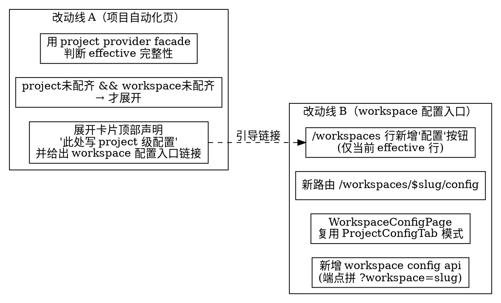

# Workspace 级配置入口与自动化 Provider 展开逻辑修正

- 状态：草案（待评审）
- 日期：2026-07-29
- 作者：协作文档（人类 + 代理）
- 关联：`README.md` / `AGENTS.md` / `DESIGN.md`

## 1. 背景与问题

Web Console 在「配置自动化」时存在两个相互关联的体验缺口：

### 1.1 项目自动化页的「Agent Provider 配置」展开逻辑误导用户

现状（`web/src/features/workspace/project-workbench/automations/project-automations-page.tsx:70-72,203-209`）：项目自动化页用一个**仅判断 project 自身配置**的 `providerComplete` 决定是否展开 `AutomationProviderConfigSection`：

```tsx
const providerComplete = projectConfig.data
  ? isProviderConfigComplete(providerConfigFromEntries(projectConfig.data))
  : false
// ...
{providerComplete ? null : <AutomationProviderConfigSection ... />}
```

`isProviderConfigComplete`（`automation-provider-config.tsx:37-43`）只检查 project 自己存了 `base_url / api_key / model` 没有。

**问题**：后端的项目自动化规则在解析 provider 时，走的是 **project → workspace → default** 的 fallback 链（`internal/app/project_automation_preview.go:224-243` 的 `projectAutomationEffectiveConfigValue`）。也就是说，**即使 project 一行配置都没写，只要 workspace 配了 provider，项目规则照样能正常投递**。

但前端 UI 无视这条 fallback 链：只要 project 自己没配齐，就一直强行展开「Agent Provider 配置」卡片，而且卡片里**完全没说明写的是 project 级配置**，容易让用户误以为「这是唯一能配 provider 的地方」、或误以为「不配就一定不工作」。

### 1.2 没有任何入口能编辑「workspace 级 config 值」

现状：
- `/settings`（`SettingsRoute.tsx`）渲染的 `ConfigDefinitionsPage variant="workspace"` **只管理 config 的 schema 定义**，不编辑 config 值。
- workspace 级 config **值**的编辑 UI 目前**根本不存在**：只有项目级 `ProjectConfigTab`（`web/src/pages/project-config-tab.tsx`）有完整的值编辑能力。
- workspace 配置值只能通过 MCP `config_set`（scope=workspace）或原始 HTTP `PUT /api/v1/config/{key}` 修改，Web Console 没有可视化入口。

用户想做「给这个 workspace 配上 Agent Provider」这类操作时，无处下手——尤其当项目规则想复用 workspace 级 provider 配置时。

### 1.3 目标

1. 修正项目自动化页的展开逻辑：**只有 project 自身没配齐、且 workspace 也没配齐（即 effective 不完整）才展开**；展开后明确告知「此处写的是 project 级配置」，并引导用户去编辑 workspace 级配置。
2. 在 `/workspaces` 列表行右侧新增「配置」入口，跳转到一个**新设置页 `/workspaces/{slug}/config`**，用来编辑该 workspace 的**全部 config 值**（对标项目级 `ProjectConfigTab` 的体验）。

## 2. 关键约束与已确认决策

以下决策已与用户确认，作为本 spec 的既定前提，不在实现阶段再纠结：

| # | 决策 | 理由 |
|---|---|---|
| C1 | 新页 `/workspaces/{slug}/config` 只编辑 **config 值**，schema 定义继续留在 `/settings` | 与项目级 `ProjectConfigTab` 边界对齐，不与 `/settings` 职责重叠 |
| C2 | `/workspaces` 行的「配置」按钮**仅对当前 effective workspace 那一行显示**；其它行不渲染按钮 | 普通 token 不能跨 workspace 写 config（后端 `workspace_scope_denied`），隐藏入口比「点了才报错」更诚实 |
| C3 | 点击按钮后**跳转独立设置页**（非行内 Dialog） | 信息密度需求高，对标现有 settings 路由模式 |
| C4 | 新页**复用** `ProjectConfigTab` 的模式：列 effective 配置 + 每行可编辑/恢复 + 底部「新增配置值」下拉 | 现成、经过验证的交互模式；`EffectiveRow` / `AddValueDialog` / `ConfigValueControl` 是纯 UI 组件可直接抽离复用 |
| C5 | **后端无需新增端点** | `requestWorkspaceRef`（`internal/httpapi/app_service.go:116-121`）已支持 `?workspace={slug}` 覆盖 effective workspace；由于 C2 只对当前 effective workspace 行显示入口，鉴权天然通过，不存在跨 workspace 写 |
| C6 | 新页对标项目级「全部已定义 schema 的 key（effective 视图）」模式，而非「只列已显式设置的 key」 | 与 `ProjectConfigTab` 一致，用户能一眼看到「这个 workspace 能配什么」 |

### 2.1 权限硬墙（重要，决定 C2 / C5 的正确性）

- `GET /api/v1/workspaces` 返回的是用户**可见的全部 workspace**（`scoped.ListWorkspaces`，`httpapi/workspaces.go:57-69`），可能不止当前 effective 那一个。
- 普通 token 跨 workspace 写 config 会被后端拒绝（`internal/app/request_scope.go` 的 `resolveRequestWorkspace` + `authz/scope.go` 的 `AllowsWorkspace`，返回 `workspace_scope_denied` 或 `membership_not_found`）。验证测试见 `internal/app/admin_workspace_test.go:514-547`。
- 因此前端「配置」按钮**绝不能**对所有行无条件渲染后让用户点了再撞 403。C2 的「仅当前 effective 行显示」是唯一不做 hack、又诚实的方案。

## 3. 方案概览

两条改动线**相互独立、可单独交付**：

```
改动线 A：项目自动化页 Provider 展开逻辑修正（前端，无后端改动）
改动线 B：/workspaces 行配置入口 + /workspaces/{slug}/config 设置页（前端，无后端改动）
```

二者的连接点：A 改完后，展开卡片里会用链接把用户导向 B 的新页（编辑 workspace 级 provider 配置）。



## 4. 改动线 A：项目自动化页 Provider 展开逻辑修正

### 4.1 问题根因（第一性）

页面用「project 自己存了什么」来推断「项目规则能不能工作」，但后端规则的真实依据是「effective 值」（含 workspace fallback）。**前端的判断维度和后端的生效维度不一致**，这是 bug 的本质。

### 4.2 修法

数据源切换：不再用 `listProjectConfig` + 前端 `isProviderConfigComplete` 拼凑，改用后端**已存在的项目 provider safe facade**：

- `GET /api/v1/projects/{projectRef}/automations/provider-config`（`internal/httpapi/huma_routes.go:1300`，handler `handleProjectAutomationProviderConfigGet`）
- 该 facade 返回 `complete` 布尔字段（`internal/app/automation_provider_config.go`，按 effective 值计算），正是「effective 是否配齐」的权威信号。

前端改动（`project-automations-page.tsx`）：

1. 删除 `projectConfig` / `providerConfigFromEntries` / `isProviderConfigComplete` 这条「project 自身判断」链路（`automation-provider-config.tsx` 里的 `providerConfigFromEntries` / `isProviderConfigComplete` 若仅此处使用则一并移除，否则保留）。
2. 新增对项目 provider facade 的查询（新建 `useProjectAutomationProviderConfig` hook，或在 `project-automations-api.ts` 加 `getProjectAutomationProviderConfig(projectRef)` + 对应 hook），取 `complete` 字段。
3. 展开条件改为：

   ```tsx
   {effectiveProviderComplete ? null : (
     <AutomationProviderConfigSection ... />
   )}
   ```

   即 **effective 不完整才展开**（隐含「project 没配齐 && workspace 也没配齐」）。

> 说明：本 spec 不再保留「project 自身完整性」这个中间变量——effective 完整性才是决定展开与否的唯一依据。这样语义单一、无歧义。

### 4.3 展开卡片的文案修正（`AutomationProviderConfigSection`）

当前卡片（`automation-provider-config.tsx:101-172`）顶部只有一个标题和「已配置/缺少 xxx」状态，**完全没说明写入范围**。修正：

1. 卡片顶部新增一行明确声明作用域：

   > 此处的 base_url / API Key / model / allowed_hosts 将写入 **当前项目（project 级）配置**。

2. 当该 workspace 尚未配置 provider（即 workspace 级也不完整）时，在卡片内追加引导：

   > 建议优先配置 **workspace 级** provider，这样同 workspace 下所有项目可共享，无需逐项目配置。
   > 前往配置：[workspace 名称]（链接到 `/workspaces/{effectiveWorkspaceSlug}/config`）

   链接目标即改动线 B 的新页。判断「workspace 级是否完整」可复用 workspace provider facade `GET /api/v1/automations/provider-config`（`huma_routes.go:1286`）的 `complete` 字段；若不想多一次请求，也可在卡片里无条件展示引导（因为只有 effective 不完整时才会看到此卡片，引导总是有用的）。

   **决策**：卡片内**无条件**展示 workspace 配置引导链接（不再额外请求 workspace facade）。理由：能展开此卡片的前提已是 effective 不完整，引导用户去配 workspace 级永远是合理建议，省一次网络请求、逻辑更简单。

### 4.4 ASCII 原型（改动线 A 展开后）

```
┌─ 项目自动化 ─────────────────────────────────────────────┐
│  规则列表 ...                                             │
├──────────────────────────────────────────────────────────┤
│  ┌─ Agent Provider 配置                      缺少 base_url ─┐
│  │                                                            │
│  │  ⚠ 预览和测试需要先配置 Agent Provider                      │
│  │                                                            │
│  │  此处的配置将写入【当前项目（project 级）】配置。            │  ← 新增声明
│  │                                                            │
│  │  💡 建议优先配置 workspace 级 provider，                     │  ← 新增引导
│  │     同 workspace 下所有项目可共享，无需逐项目配置。            │
│  │     前往配置：ws-prod →  （链接到 /workspaces/ws-prod/config）│
│  │                                                            │
│  │  Base URL      [                          ]                 │
│  │  API Key       [                          ] (password)      │
│  │  Model         [                          ]                 │
│  │  Allowed Hosts [                          ] (可选)           │
│  │                                            [ 保存配置 ]      │
│  └────────────────────────────────────────────────────────────┘
└──────────────────────────────────────────────────────────────┘
```

修正前后行为对比：

| 场景 | 修正前 | 修正后 |
|---|---|---|
| project 未配、workspace 已配 | ❌ 仍展开卡片（误导：以为必须配 project） | ✅ 不展开（effective 已完整） |
| project 未配、workspace 也未配 | 展开（但不说写哪级） | 展开，且声明写 project 级 + 引导去配 workspace 级 |
| project 已配 | 不展开 | 不展开（不变） |

## 5. 改动线 B：workspace 配置入口与新设置页

### 5.1 B1：`/workspaces` 列表行新增「配置」按钮

改动文件：`web/src/features/workspace/workspaces/workspace-console.tsx`。

当前 Actions 列（`:96-123`）只有 Archive / Restore。新增一个「配置」按钮：

- **显示条件**：`ws.slug === me.effective_workspace.slug`（通过 `useMe()` 获取 effective workspace slug）。
- **形态**：`<Link>`（TanStack Router）跳转到 `/workspaces/$workspaceSlug/config`，与 Archive 按钮并排。文案 `配置`（i18n key 待定，建议 `workspacesConsole.config`）。
- **非当前 effective 行**：不渲染「配置」按钮（按 C2，不显示比禁用更诚实——禁用反而引诱用户疑惑「为什么这行点不了」）。

```tsx
// 伪代码
const me = useMe()
const effectiveSlug = me.data?.effective_workspace.slug
// ...
<TableCell className="text-right">
  {ws.slug === effectiveSlug ? (
    <Link
      to="/workspaces/$workspaceSlug/config"
      params={{ workspaceSlug: ws.slug }}
    >
      <Button size="sm" variant="outline">{t("workspacesConsole.config")}</Button>
    </Link>
  ) : null}
  {/* Archive / Restore 逻辑不变 */}
</TableCell>
```

> 注：`WorkspaceConsole` 的 `canWrite` prop 当前恒为 `true`（`resource-dispatch.tsx:63`）。「配置」按钮的写权限由后端 scopedService 判定，前端不做额外禁用。

### 5.2 B2：ASCII 原型（`/workspaces` 列表）

```
┌─ 工作空间 ──────────────────────────────────────────────────────────┐
│ 管理你可见的工作空间。                                                 │
├──────────────┬──────────────┬──────────┬──────────────────────────────┤
│ Slug         │ 名称         │ 状态     │ 操作                          │
├──────────────┼──────────────┼──────────┼──────────────────────────────┤
│ ws-prod      │ 生产         │ Active   │ [配置] [Archive]   ← 当前行    │  ← 新增[配置]
│ ws-staging   │ 预发         │ Active   │ [Archive]                     │  ← 非当前行，不显示[配置]
│ ws-dev       │ 开发         │ Active   │ [Archive]                     │
│ ws-old       │ 归档历史     │ Archived │ [Restore(禁用)]               │
└──────────────┴──────────────┴──────────┴──────────────────────────────┘
```

### 5.3 B3：新路由 `/workspaces/$workspaceSlug/config`

新增路由（仿 `workspaceCustomFieldsRoute`，`router.tsx:489-493`）：

```tsx
const workspaceConfigRoute = createRoute({
  getParentRoute: () => workspaceRootRoute,
  path: "/workspaces/$workspaceSlug/config",
  component: lazyRoute(WorkspaceConfigRoute),
})
```

注册进 `routeTree`（`router.tsx:501+` 的 `workspaceRootRoute.addChildren([...])`）。

新增路由组件 `web/src/routes/workspace/WorkspaceConfigRoute.tsx`：

```tsx
export function WorkspaceConfigRoute() {
  const params = useParams({ strict: false }) as { workspaceSlug: string }
  const me = useMe()
  const effectiveSlug = me.data?.effective_workspace.slug
  return (
    <>
      <WorkspaceSettingsNav active="config" workspaceSlug={params.workspaceSlug} />
      {/* canManage 取当前用户在该 workspace 是否具备 config 写权限，复用 useMe + canConfigManage（与 ConfigDefinitionsPage 同源）。 */}
      <WorkspaceConfigPage
        workspaceSlug={params.workspaceSlug}
        canManage={canConfigManage(useMe().data)}
      />
    </>
  )
}
```

> 防御：虽然 C2 保证只有当前 effective 行能进入此页，但仍校验 `params.workspaceSlug === effectiveSlug`；若不一致（如用户手改 URL），页面降级为只读并提示「仅可在当前工作空间上下文编辑配置」。这处理了直接粘贴 URL 的边界情况。

### 5.4 B4：页面组件 `WorkspaceConfigPage`

新建 `web/src/pages/workspace-config-page.tsx`，**对标 `ProjectConfigTab`**（`web/src/pages/project-config-tab.tsx`）。

**核心做法**：把 `ProjectConfigTab` 里的 `EffectiveRow` / `AddValueDialog` / `sourceLabel` / `canEditProjectScope` 等通用逻辑**抽离成共享组件**，供 project 和 workspace 两边复用。

抽离目标：`web/src/features/workspace/config/effective-config-editor.tsx`（新文件），导出：

- `<EffectiveConfigList>`：接收 `rows: ConfigEffectiveValue[]`、`canEdit`（行级判定函数）、`onSave(key, value)`、`onRestore(key)`，内部渲染每行（原 `EffectiveRow`）。
- `<AddConfigValueDialog>`：接收 `rows`、`onSave`，内部渲染「新增配置值」下拉（原 `AddValueDialog`）。
- `sourceLabel(source, t)` 工具函数。

抽离时把「project scope 判定」（`canEditProjectScope`，检查 `allowed_scopes.includes("project")`）参数化为外部传入的 `canEditRow(row)` 回调，使组件与 scope 解耦：

- project 侧：`canEditRow = (row) => allowed_scopes.includes("project")`（保持原行为）
- workspace 侧：`canEditRow = (row) => allowed_scopes.includes("workspace")`（workspace 只能写允许 workspace scope 的 key）

`WorkspaceConfigPage` 结构：

```tsx
export function WorkspaceConfigPage({ workspaceSlug, canManage }: Props) {
  const effectiveSlug = /* useMe */
  const isCurrent = workspaceSlug === effectiveSlug
  const queryKey = ["workspace", workspaceSlug, "config", "effective"]
  const effectiveQuery = useQuery({
    queryKey,
    queryFn: () => listWorkspaceEffectiveConfigForSlug(workspaceSlug),
  })
  const saveMut = useMutation({
    mutationFn: ({ key, value }) => setWorkspaceConfig(workspaceSlug, key, value),
    onSuccess: invalidate,
  })
  const deleteMut = useMutation({
    mutationFn: (key) => deleteWorkspaceConfig(workspaceSlug, key),
    onSuccess: invalidate,
  })

  if (!isCurrent) {
    return <只读降级提示>  // 见 5.3 防御
  }

  return (
    <section className="rounded-lg space-y-3 border bg-card p-4">
      <div>
        <h2 className="text-sm font-medium">工作空间配置</h2>
        <p className="text-xs text-muted-foreground">
          编辑当前工作空间「{workspaceSlug}」的配置值。schema 定义请前往 /settings。
        </p>
      </div>
      <EffectiveConfigList
        rows={effectiveQuery.data ?? []}
        canEditRow={(row) => allowedScopesIncludesWorkspace(row)}
        onSave={(key, value) => saveMut.mutateAsync({ key, value })}
        onRestore={(key) => deleteMut.mutateAsync(key)}
      />
      {canManage ? (
        <AddConfigValueDialog
          rows={effectiveQuery.data ?? []}
          onSave={(key, value) => saveMut.mutateAsync({ key, value })}
        />
      ) : null}
    </section>
  )
}
```

### 5.5 B5：新增 workspace config api 函数

新建 `web/src/features/workspace/config/workspace-config-api.ts`（或在 `config-definition-api.ts` 追加），**完全对标 `project-api.ts` 的 `workspaceQuery` 模式**（`project-api.ts:197,350-414`）：

```ts
function workspaceQuery(workspaceSlug: string): string {
  return `workspace=${encodeURIComponent(workspaceSlug)}`
}

export function workspaceConfigEffectivePath(workspaceSlug: string): string {
  return `/api/v1/config/effective?${workspaceQuery(workspaceSlug)}`
}

export function workspaceConfigKeyPath(workspaceSlug: string, key: string): string {
  return `/api/v1/config/${encodeSchemaKey(key)}?${workspaceQuery(workspaceSlug)}`
}

export function listWorkspaceEffectiveConfigForSlug(
  workspaceSlug: string
): Promise<ConfigEffectiveValue[]> {
  return workspaceApiGet<ConfigEffectiveValue[]>(
    workspaceConfigEffectivePath(workspaceSlug)
  )
}

export function setWorkspaceConfig(
  workspaceSlug: string,
  key: string,
  value: string
): Promise<void> {
  return workspaceApiPut<void>(workspaceConfigKeyPath(workspaceSlug, key), { value })
}

export function deleteWorkspaceConfig(
  workspaceSlug: string,
  key: string
): Promise<void> {
  return workspaceApiDelete<void>(workspaceConfigKeyPath(workspaceSlug, key))
}
```

> 命名注意：现有 `listWorkspaceEffectiveConfig`（无 slug，依赖 token）保留不动，新函数用 `...ForSlug` 后缀区分，避免破坏 `/settings` 等现有调用方。

### 5.6 B6：ASCII 原型（`/workspaces/{slug}/config` 页面）

```
┌─ 工作空间配置 ──────────────────────────────────────────────────────┐
│ 编辑当前工作空间「ws-prod」的配置值。schema 定义请前往 /settings。       │
├──────────────────────────────────────────────────────────────────────┤
│                                                                        │
│  agent.provider.base_url     [workspace]    https://agent.example.com  │
│  Agent Provider Base URL                          [编辑]                │
│                                                                        │
│  agent.provider.api_key      [workspace]    ••••••            [显示]    │
│  Agent Provider API Key (secret)                   [编辑]                │
│                                                                        │
│  agent.provider.model        [workspace]    gpt-4o                     │
│  Agent Provider Model                              [编辑]                │
│                                                                        │
│  agent.provider.allowed_hosts [workspace]   ["agent.example.com"]      │
│  Allowed Hosts (可选)                              [编辑]                │
│                                                                        │
│  date.format                 [default]     YYYY-MM-DD     [继承值/只读] │
│  日期格式                                                              │
│                                                                        │
│  urgency.active.coefficient [workspace]    4.0            [编辑][恢复]  │
│  活跃任务 urgency 系数（已覆盖）                                        │
│                                                                        │
│  uda.cost                   [missing]      —             [只读]         │
│  自定义 UDA（workspace scope 不可写）                                   │
│                                                                        │
│                                              [+ 新增配置值]             │
└──────────────────────────────────────────────────────────────────────────┘

点击 [+ 新增配置值]：
┌─ 新增配置值 ─────────────────────────┐
│ 选择配置项                             │
│ ┌──────────────────────────────────┐ │
│ │ ▼ 可写（workspace scope）          │ │
│ │   agent.provider.base_url (string)│ │
│ │   urgency.active.coefficient      │ │
│ │ ▼ workspace 不可写（灰显）         │ │
│ │   uda.cost (json)        [禁用]   │ │
│ └──────────────────────────────────┘ │
│ 值: [                              ]  │
│                  [取消]  [保存]        │
└────────────────────────────────────────┘
```

说明（与 `ProjectConfigTab` 行为一致）：
- 每行 Badge 标注来源：`[workspace]` / `[default]` / `[missing]`。
- workspace scope 不可写的 key（`allowed_scopes` 不含 `workspace`）显示 `[只读]`，不可编辑、不可新增。
- 已被 workspace 覆盖的行显示 `[已覆盖]` + `恢复继承` 按钮（DELETE 该 key）。
- secret 类型值默认掩码 `••••••`，点「显示」可查看。

### 5.7 导航高亮

`WorkspaceSettingsNav`（`/workspaces/{slug}/config` 页头部）的 `active` 取值需支持 `config`。需确认该 nav 组件现有 active 选项；若它原本只服务 `/settings`（active=`configDefinitions`），需评估是否复用同一 nav 还是新写一个简化版面包屑。

> 决策建议：`/workspaces/{slug}/config` 是从 `/workspaces` 列表进入的独立页，语义上不属于 `/settings` 子页。优先用一个**轻量面包屑**（`工作空间 / ws-prod / 配置` + 返回链接）而非强行复用 `WorkspaceSettingsNav`，避免 active 状态混乱。实现阶段再定具体形态，本 spec 锁定「提供返回 /workspaces 的面包屑」这一最小要求。

## 6. 设计语言与 UI 规范遵循

遵循 `DESIGN.md`「冷静的工程绿」：

- 「配置」按钮：`variant="outline" size="sm"`，与 Archive 同级，不引入新颜色。
- 页面容器：`rounded-lg border bg-card`，与 `ProjectConfigTab` 一致。
- 来源 Badge：用现有 `variant="outline"/"secondary"/"destructive"`，状态色只用小 chip，不大面积铺色。
- 数字/ID/时间：JetBrains Mono（workspace slug 用 `<code>`，沿用现有列表写法）。
- 图标：用 Lucide（如引导文案前的 💡 可换 Lucide `Lightbulb`）。
- 不引入裸 hex，所有颜色走 token。

## 7. 不做什么（YAGNI）

- **不**新增 `/api/v1/workspaces/{slug}/config` 路由——`?workspace=` query 已够用，避免与 `/api/v1/config*` 重复。
- **不**做 workspace 切换器——超管 acting/tenant 机制已存在，普通用户不需要。
- **不**让非当前 effective 行显示「配置」按钮——避免 403 困境。
- **不**在新页编辑 schema 定义——那是 `/settings` 的职责。
- **不**为「判断 workspace 级是否完整」额外请求 workspace provider facade——卡片内无条件展示引导更简单。
- **不**保留「project 自身完整性」中间变量——effective 完整性是唯一展开依据。

## 8. 测试策略

前端（`pnpm --dir web test`，Vitest + RTL）：

- `workspace-console.test.tsx`：新增用例——当前 effective 行渲染「配置」按钮且链接指向 `/workspaces/{slug}/config`；非当前行不渲染「配置」按钮。
- `project-automations-page`：新增用例——mock project provider facade `complete=true` 时不展开卡片；`complete=false` 时展开，且卡片内含「写入 project 级」声明与 workspace 配置链接。
- `workspace-config-page`：新增用例——渲染 effective 行；workspace scope 不可写的 key 显示只读；保存/删除调用正确的 api 函数；URL slug ≠ effective slug 时降级只读。
- `effective-config-editor`（抽离组件）：迁移 `ProjectConfigTab` 现有行级测试，确保 project 侧行为不回归。

后端：**无需新增测试**（无后端改动）。现有 `internal/app/admin_workspace_test.go` 已覆盖跨 workspace 写被拒的边界。

集成验证：
- 手动验证：`/workspaces` 点「配置」→ 进入新页 → 编辑 `agent.provider.base_url` → 回到项目自动化页确认 provider 卡片消失（effective 已完整）。
- 命令行：`go test ./...`、`CGO_ENABLED=0 go test ./...`、`CGO_ENABLED=0 go build ./cmd/xuanchu`、`pnpm --dir web typecheck && lint && build && test`（按 AGENTS.md §6）。

## 9. 交付拆分

两条改动线可分别成 PR：

1. **PR-1（改动线 A）**：项目自动化页展开逻辑修正 + 卡片文案。无后端、无新路由，风险最低，可先行。
2. **PR-2（改动线 B）**：抽离 `EffectiveConfigList`/`AddConfigValueDialog` 共享组件（含 project 侧迁移）+ 新路由 + 新页 + workspace config api + `/workspaces` 行按钮。

PR-2 内部顺序：先抽离共享组件并保证 project 侧不回归 → 再加 workspace 侧 api 与新页 → 最后加 `/workspaces` 行按钮。

## 10. 文档同步

- `README.md`：如「配置」入口属用户可见行为变化，补充 workspace config 编辑入口说明。
- `ROADMAP.md`：如属于既有 milestone 范围内的小改进，无需新增 milestone；若评审认为扩大范围，则更新对应条目。
- 本 spec 通过后，由 writing-plans 产出 implementation plan（`docs/superpowers/plans/2026-07-29-workspace-config-entry-implementation.md`）。
